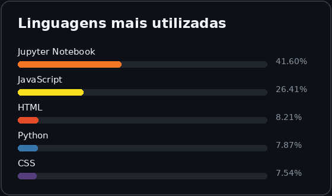

# 👋 Olá, eu sou Gabriel!

### 💻 IT | Data | Automation 🚀

Sou apaixonado por tecnologia e desenvolvimento de soluções, com foco em **dados, automação de processos e sistemas**.

---

## 🚀 Sobre mim

💻 Tecnologia da Informação  
📊 Dados e Business Intelligence  
⚙️ Automação de processos  
🗄️ Banco de dados e APIs  
🎯 Sempre buscando transformar problemas em soluções através da tecnologia.

---

## 🛠️ Tecnologias & Ferramentas

**Linguagens**

**Dados & BI**

**Automação & Integrações**

**Ferramentas**

---

## 📌 Projetos

🚧 **Projetos em desenvolvimento...**
- Hekp desk
- Sistema de Login
- Sistema de conferência de produtos automatizada

---

## 📊 GitHub Stats

  

## 💻 Linguagens mais utilizadas

  

###

## 📫 Contato

💼 [LinkedIn](https://www.linkedin.com/in/gabrielrochadelima/)

📧 **[gabrielrochadelima@hotmail.com](mailto:gabrielrochadelima@hotmail.com)**
